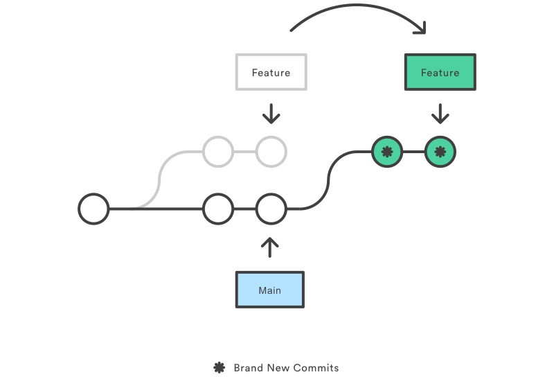

# Git-Note 
[toc]{type: "ul", level: [2,3,4]}

## Overview
### Version Control Systems (VCS)
Version control, also known as source control, is the practice of ***tracking*** and ***managing*** changes to software code. 

#### Benefits of version control systems
1. **A complete long-term change history of every file.** 
2. **Branching and mergeing**
3. **Traceablity**

### Srouce Code Management (SCM)
Source code management (SCM) is used to ***track modifications*** to a source code repository.

SCM brought version control safeguards to prevent loss of work due to conflict overwriting. These safeguards work by tracking changes from each individual developer and identifying areas of conflict and preventing overwrites. SCM will then communicate these points of conflict back to the developers so that they can safely review and address.

As software projects grow in lines of code and contributor head count, the costs of communication overhead and management complexity also grow. SCM is a critical tool to alleviate the organizational strain of growing development costs.

#### Source code management best practices
1. **Commit often**
    Each commit is a snapshot that the codebase can be reverted to if needed. Frequent commits give many opportunities to revert or undo work. A group of commits can be combined into a single commit using a rebase to clarify the development log.
2. **Ensure you're working from latest version**
    Make sure to git pull or fetch the latest code before making updates. This will help avoid conflicts at merge time.
3. **Make detailed notes**
    It is important to leave descriptive explanatory commit log messages. These commit log messages should explain the “why” and “what” that encompass the commits content. These log messages become the canonical history of the project’s development and leave a trail for future contributors to review.
4. **Review changes before committing**
    The staging area can be used to manage and review changes before creating the commit snapshot. Utilizing the staging area in this manner provides a buffer area to help refine the contents of the commit.
5. **Use Branches**
    Branches should be used frequently as they are quick and inexpensive. Branches enable multiple developers to work in parallel on separate lines of development. These lines of development are generally different product features. When development is complete on a branch it is then merged into the main line of development.
6. **Agree on a Workflow**
    SCM workflows establish patterns and processes for merging branches. If a team doesn't agree on a shared workflow it can lead to inefficient communication overhead when it comes time to merge branches.
    
### What is Git
Git is the most widely used modern version control system in the world.

Having a ***distributed*** architecture, Git is an example of a DVCS (hence Distributed Version Control System). Rather than have only one single place for the full version history of the software as is common in once-popular version control systems like CVS or Subversion (also known as SVN), in Git, every developer's working copy of the code is also a repository that can contain the full history of all changes.

In addition to being distributed, Git has been designed with ***performance***, ***security*** and ***flexibility*** in mind.

### What is an SSH Key
An SSH key is an ***access credential*** for the ***SSH (secure shell)*** network protocol. This authenticated and encrypted secure network protocol is used for remote communication between machines on an unsecured open network. SSH is used for ***remote file transfer***, ***network management***, and ***remote operating system access***. 

SSH uses a pair of keys to initiate a secure handshake between remote parties. The key pair contains a ***public and private key***. The private vs public nomenclature can be confusing as they are both called keys. It is more helpful to think of the public key as a "lock" and the private key as the "key". You give the public 'lock' to remote parties to encrypt or 'lock' data. This data is then opened with the 'private' key which you hold in a secure place.

#### Creating SSH Key (macOS & Linux)
1. **Check for existing SSH Key**
   ```shell
   $ cd ~/.ssh && ls id_*
   ```
2. **Back up old SSH keys**
    ```shell
    $ mkdir key_bak && cp id_* key_bak
    ```
3. **Generate a new key**
    ```shell
    $ ssh-keygen -t rsa -b 4096 -C "<your_email@example.com>"
    ```
#### ssh-agent
The ssh-agent is another program that is part of the SSH toolsuite. The ssh-agent is responsible for holding private keys. Think of it like a keychain. In addition to holding private keys it also brokers requests to sign SSH requests with the private keys so that private keys are never passed around unsecurly.
1. **ensure the ssh-agent is running**
    ```shell
    $ eval "$(ssh-agent -s)"
    ```
2. **check if SSH private key is loaded**
    ```shell
    $ ssh-add -l
    ```
3. **add the new SSH key to the local SSH agent**
    ```shell
    $ ssh-add -K ~/.ssh/id_rsa
    ```
### Git Archive
Export a git project.
```shell
$ git archive --output=./example_repo_archive.tar --format=tar HEAD
```
The format option also accepts popular compressed file formats zip and tar.gz.
> --format=tar / zip / tar.gz

```shell
$ git archive --output=./example_repo_archive.tar.gz --format=tar HEAD ./build
```
This command will output an archive containing only files stored under the ./build directory

```shell
$ git archive --remote=<repo> --output=./example_repo_archive.tar --format=tar HEAD 
```
The remote option expects a remote repository URL. When invoked with the remote option, git-archive will fetch the remote repository and create an archive from the specified ref if it’s available.

## Getting Started
By the end of this module, you should be able to create a Git repo, use common Git commands, commit a modified file, view your project’s history and configure a connection to a Git hosting service.

### What is a Git repository?
A Git repository is a virtual storage of your project. It allows you to save versions of your code, which you can access when needed. 
### Setting up a repository
#### Initializing a new Git repo
```shell
$ git init
```
Executing this command will create a new ***.git*** subdirectory in your current working directory. This will also create a new main branch. 

##### .git
which contains all of the necessary Git metadata for the new repository. This metadata includes subdirectories for objects, refs, and template files. A HEAD file is also created which points to the currently checked out commit.

##### Bare repository --bare
Initialize an empty Git repository, but omit the working directory. Shared repositories should always be created with the --bare flag.

The --bare flag creates a repository that doesn’t have a working directory, making it impossible to edit files and commit changes in that repository.
```shell
$ git init --bare <directory>
```

This means that for virtually all Git workflows, the ***central repository is bare***, and developers local repositories are non-bare.


The most common use case for  git init --bare is to create a remote central repository:
```shell
$ ssh <user>@<host> cd path/above/repo git init --bare my-project.git
```

1. SSH into the server that will contain your central repository. 
2. Navigate to wherever you’d like to store the project. 
3. Use the --bare flag to create a central storage repository. 
4. Developers would then clone my-project.git to create a local copy on their development machine.

#### Cloning an existing Git repo
Git’s idea of a “working copy” is very different from the working copy you get by checking out code from an SVN repository. Unlike SVN, Git makes no distinction between the working copy and the central repository—they're all full-fledged Git repositories.

Whereas SVN depends on the relationship between the central repository and the working copy, Git’s collaboration model is based on ***repository-to-repository interaction***. Instead of checking a working copy into SVN’s central repository, you push or pull commits from one repository to another.


`git clone` is primarily used to point to an existing repo and make a clone or copy of that repo at in a new directory, at another location. The original repository can be located on the local filesystem or on remote machine accessible supported protocols.

> As a convenience, cloning automatically creates a remote connection called "origin" pointing back to the original repository. This automatic connection is established by creating Git refs to the remote branch heads under refs/remotes/origin and by initializing remote.origin.url and remote.origin.fetch configuration variables.

Obtain a local copy of a central repository stored on a server accessible at example.com using the SSH username \[user\]:
```shell
$ git clone ssh://user@example.com/path/to/my-project.git 
$ cd my-project 
# Start working on the project
```

##### Cloning to a specific folder
```shell
$ git clone <repo> <directory>
```

##### Branches -branch
```shell
$ git clone -branch <branch> <repo>
```
The -branch argument lets you specify a specific branch to clone instead of the branch the remote HEAD is pointing to, usually the main branch. 

##### Cloning a specific tag
```shell
$ git clone --branch <tag> <repo>
```
 
##### Shallow clone
```shell
$ git clone -depth=1 <repo>
```
In this example a clone of ＜repo＞ is made and only the most recent commit is included in the new cloned Repo. Shallow cloning is most useful when working with repos that have an extensive commit history. An extensive commit history may cause scaling problems such as disk space usage limits and long wait times when cloning. A Shallow clone can help alleviate these scaling issues.

##### Clone Bare repository --bare
```shell
$ git clone --bare <repo>
```
Similar to git init --bare, when the -bare argument is passed to git clone, a copy of the remote repository will be made with an omitted working directory. This means that a repository will be set up with the history of the project that can be pushed and pulled from, but cannot be edited directly. In addition, no remote branches for the repo will be configured with the -bare repository. Like git init --bare, this is used to create a hosted repository that developers will not edit directly.

##### Clone Mirror repository --mirror
```shell
$ git clone --mirror <repo>
```
Passing the --mirror argument implicitly passes the --bare argument as well. This means the behavior of --bare is inherited by --mirror. Resulting in a bare repo with no editable working files. In addition, --mirror will clone all the extended refs of the remote repository, and maintain remote branch tracking configuration. You can then run git remote update on the mirror and it will overwrite all refs from the origin repo. Giving you exact 'mirrored' functionality.

##### Git URLs
Git has its own URL syntax which is used to pass remote repository locations to Git commands.

Git URL protocols:
1. SSH
    Secure Shell (SSH) is a ubiquitous authenticated network protocol that is commonly configured by default on most servers. Because SSH is an authenticated protocol, you'll need to establish credentials with the hosting server before connecting.
    ```shell
    ssh://[user@]host.xz[:port]/path/to/repo.git/
    ```
2. GIT
    A protocol unique to git. Git comes with a daemon that runs on port (9418). The protocol is similar to SSH however it has NO AUTHENTICATION. 
    ```shell
    git://host.xz[:port]/path/to/repo.git/
    ```
3. HTTP
    Hyper text transfer protocol. The protocol of the web, most commonly used for transferring web page HTML data over the Internet. Git can be configured to communicate over HTTP.
    ```shell
    http[s]://host.xz[:port]/path/to/repo.git/
    ```
   
#### Configuring Git
The `git config` command is a convenience function that is used to set Git configuration values on a global or local project level.

Configuration names are dot delimited strings composed of a ***'section'*** and a ***'key'*** based on their hierarchy. For example: `user.email`

```shell
$ git config --global user.email "your_email@example.com"
```

##### Configuration Levels
- --local
    (default) Local configuration values are stored in a file that can be found in the repo's .git directory: .git/config
- --global
    Applied to an operating system user. Global configuration values are stored in a file that is located in a user's home directory. ~ /.gitconfig.
- --system
    Applied across an entire machine. The system level configuration file lives in a gitconfig file off the system root path. $(prefix)/etc/gitconfig.

##### git config --global core.editor
Many Git commands will launch a text editor to prompt for further input.

| editor | command |
| -- | -- |
| Atom | git config --global core.editor "atom --wait" |
| emacs | git config --global core.editor "emacs" |
| nano | git config --global core.editor "nano -w" |
| vim | git config --global core.editor "vim" |
| Sublime Text (Mac) | git config --global core.editor "subl -n -w" |

##### Merge tools
In the event of a merge conflict, Git will launch a "merge tool." By default, Git uses an internal implementation of the common Unix diff program. The internal Git diff is a minimal merge conflict viewer. There are many external third party merge conflict resolutions that can be used instead.
```shell
$ git config --global merge.tool <...>
```

#### Git Alias
Aliases are used to create shorter commands that map to longer commands.
> Aliases can be created in a local or global scope.
```shell
$ git config --global alias.co checkout
$ git config --global alias.br branch
$ git config --global alias.ci commit
$ git config --global alias.st status
```

Creating the aliases will not modify the source commands. So `git checkout` will still be available even though we now have the `git co` alias.

These aliases were created with the --global flag which means they will be stored in Git's global operating system level configuration file. On linux systems, the global config file is located in the User home directory at /.gitconfig. (Which means the global or local config files can be manually edited and saved to create aliases.)
```text
    [alias]
        co = checkout
        br = branch
        ci = commit
        st = status
```

##### Using aliases to create new Git commands
A common Git pattern is to remove recently added files from the staging area. This is achieved by leveraging options to the git reset command. A new alias can be created to encapsulate this behavior and create a new alias-command-keyword which is easy to remember:
```shell
$ git config --global alias.unstage 'reset HEAD --'
```
This makes the following two commands equivalent.
```shell
$ git unstage fileA
$ git reset HEAD -- fileA
```

### Saving Changes
#### Basic edit/stage/commit pattern
The traditional software expression of "saving" is synonymous with the Git term "committing". A commit is the Git equivalent of a "save". `git commit`

Git is a distributed application model whereas SVN is a centralized model (needs Internet access). 

Git commits can be captured and built up locally, then pushed to a remote server as needed using the `git push -u origin main` command.

Git has an additional saving mechanism called 'the stash'. The stash is an ephemeral storage area for changes that are not ready to be committed. `git add`

#####  The staging area
The primary function of the git add command, is to promote pending changes in the working directory, to the ***git staging area***.

##### Adding to the staging area
```shell
$ git add <file>
# Stage all changes in <file> for the next commit.

$ git add <directory>
# Stage all changes in <directory> for the next commit.

$ git add --all / git add -A
# Stage all changes at a time
```

The `git add` command adds a change in the working directory to the staging area. It tells Git that you want to include updates to a particular file in the next commit. However, git add doesn't really affect the repository in any significant way—changes are not actually recorded until you run `git commit`.

> you'll also need `git status` to view the state of the working directory and the staging area.


#### Recording into the repository’s history
Stage changes with `git add`. After you’re happy with the staged snapshot, you commit it to the project history with `git commit`.

Commits can be thought of as snapshots or milestones along the timeline of a Git project. Commits are created with the `git commit` command to capture the state of a project at that point in time. Git Snapshots are always committed to the local repository. 

Just as the staging area is a buffer between the working directory and the project history, each developer’s local repository is a buffer between their contributions and the central repository.

SVN commit consists of a diff compared to the original file added to the repository. Git, on the other hand, records the entire contents of each file in every commit.


```shell
$ git commit -m "<message>"
# Move from stage to commit

$ git commit -a -m "<message>"
# -a option will automatically stage every changed, already tracked file.

$ git commit -a -m "<message>" --amend
# Update a commit: Instead of creating a new commit, staged changes will be added to the previous commit.

$ git commit
# This will open a text editor (customizable via git config) asking for a commit log message
```

> Canonical format is to summarize the entire commit on the first line in less than 50 characters, leave a blank line, then a detailed explanation of what’s been changed.

#### Comparing changes with git diff
Diffing is a function that takes two input data sets and outputs the changes between them. git diff is a multi-use Git command that when executed runs a diff function on Git data sources. These data sources can be ***commits***, ***branches***, ***files*** and more. 

The git diff command is often used along with git status and git log to analyze the current state of a Git repo.

```shell
$ git diff 
# Comparing all changes
```

##### Comparing files: git diff file
```shell
$ git diff HEAD ./path/to/file
# By default git diff will execute the comparison against HEAD.

$ git diff --cached ./path/to/file
# --cached option the diff will compare the staged changes with the local repository. The --cached option is synonymous with --staged.
```

##### Comparing files between two different commits
```shell
$ git diff <file>
# Changes since last commit

$ git diff 957f...b72c ce48...9e7a <file>
# Comparing files between two different commits
```

##### Comparing branches
```shell
$ git diff branch1..branch2 <file>
$ git diff branch1 branch2 <file>
# Comparing two branches
```

#### Stashing changes
`git stash` temporarily ***shelves*** (or stashes) changes you've made to your working copy so you can work on something else, and then come back and re-apply them later on. 

```shell
% git status
On branch master
Changes not staged for commit:
  (use "git add <file>..." to update what will be committed)
  (use "git restore <file>..." to discard changes in working directory)
	modified:   diff_test.txt

Untracked files:
  (use "git add <file>..." to include in what will be committed)
	new.txt

no changes added to commit (use "git add" and/or "git commit -a")
% git stash
Saved working directory and index state WIP on master: 05fb78d second
% git add new.txt 
% git stash
Saved working directory and index state WIP on master: 05fb78d second
% git status       
On branch master
nothing to commit, working tree clean
```
At this point you're free to make changes, create new commits, switch branches, and perform any other Git operations; then come back and re-apply your stash when you're ready.

Note that the stash is local to your Git repository; stashes are not transferred to the server when you push.

##### Re-applying stashed changes
```shell
$ git stash pop
```

```shell
% git status
On branch master
nothing to commit, working tree clean
% git stash pop
On branch master
Changes to be committed:
  (use "git restore --staged <file>..." to unstage)
	new file:   new.txt

Dropped refs/stash@{0} (9fa860813ec7108c069374903f497459bd4f26fd)
% git status   
On branch master
Changes to be committed:
  (use "git restore --staged <file>..." to unstage)
	new file:   new.txt

% git stash pop
On branch master
Changes to be committed:
  (use "git restore --staged <file>..." to unstage)
	new file:   new.txt

Changes not staged for commit:
  (use "git add <file>..." to update what will be committed)
  (use "git restore <file>..." to discard changes in working directory)
	modified:   diff_test.txt

Dropped refs/stash@{0} (e17d4cbe8e736a03b8625f963e236474b3b6b6c6)
% git status
On branch master
Changes to be committed:
  (use "git restore --staged <file>..." to unstage)
	new file:   new.txt

Changes not staged for commit:
  (use "git add <file>..." to update what will be committed)
  (use "git restore <file>..." to discard changes in working directory)
	modified:   diff_test.txt

% git stash pop
No stash entries found.
```

Popping your stash removes the changes from your stash and reapplies them to your working copy.

Alternatively, you can reapply the changes to your working copy and keep them in your stash with git stash apply (***working with multiple branches***):
```shell
$ git stash apply
On branch main
Changes to be committed:

    new file:   style.css

Changes not staged for commit:

    modified:   index.html
```
This is useful if you want to apply the same stashed changes to multiple branches.

Also:
```shell
$ git stash -u / --include-untracked
# stash to also stash your untracked files

$ git stash -a / --all
# include changes to ignored files as well by passing the -a option (or --all)
```


##### Managing multiple stashes
You can run git stash several times to create multiple stashes, and then use `git stash list` to view them. 
```shell
$ git stash list
stash@{0}: WIP on main: 5002d47 our new homepage
stash@{1}: WIP on main: 5002d47 our new homepage
stash@{2}: WIP on main: 5002d47 our new homepage
```
It's good practice to annotate your stashes with a description, using `git stash save "message"`

By default, git stash pop will re-apply the most recently created stash: stash@{0}

Choose which stash to re-apply by passing its identifier as the last argument:
```shell
$ git stash pop stash@{2}
```

##### Viewing stash diffs
```shell
$ git stash show
# view a summary of a stash

$ git stash show -p
# view the full diff of a stash
```

##### Partial stashes
You can also choose to stash just a single file, a collection of files, or individual changes from within files. 

it will iterate through each changed "hunk" in your working copy and ask whether you wish to stash it:
```shell
$ git stash -p
diff --git a/style.css b/style.css
new file mode 100644
index 0000000..d92368b
--- /dev/null
+++ b/style.css
@@ -0,0 +1,3 @@
+* {
+  text-decoration: blink;
+}
Stash this hunk [y,n,q,a,d,/,e,?]? y
diff --git a/index.html b/index.html
index 9daeafb..ebdcbd2 100644
--- a/index.html
+++ b/index.html
@@ -1 +1,2 @@
+<link rel="stylesheet" href="style.css"/>
Stash this hunk [y,n,q,a,d,/,e,?]? n
```


| Command | Description |
| -- | -- |
| / | search for a hunk by regex |
| ? | help |
| n | don't stash this hunk |
| q | quit (any hunks that have already been selected will be stashed) |
| s | split this hunk into smaller hunks |
| y | stash this hunk |

> There is no explicit "abort" command, but hitting CTRL-C(SIGINT) will abort the stash process.

##### Creating a branch from your stash
If the changes on your branch diverge from the changes in your stash, you may run into conflicts when popping or applying your stash. Instead, you can use `git stash branch` to create a new branch to apply your stashed changes to:

```shell
$ git stash branch [branch_name] stash@{1}
```

This checks out a new branch based on the commit that you created your stash from, and then pops your stashed changes onto it.

##### Cleaning up your stash
```shell
$ git stash drop stash@{1}

$ git stash clear
```

##### How git stash works
...

#### .gitingore
Git sees every file in your working copy as one of three things:

1. tracked - a file which has been previously staged or committed;
2. untracked - a file which has not been staged or committed;
3. ignored - a file which Git has been explicitly told to ignore.

##### Git ignore patterns
| Pattern | Example matches | Explanation* |
| -- | -- | -- |
| **/logs | \*/logs/\* | You can prepend a pattern with a double asterisk to match directories anywhere in the repository. |
| *.log | *.log | An asterisk is a wildcard that matches zero or more characters. |
| *.log !important.log | *.log, but not important.log | Prepending an exclamation mark to a pattern negates it. If a file matches a pattern, but also matches a negating pattern defined later in the file, it will not be ignored. |

##### Global Git ignore rules
```shell
$ touch ~/.gitignore
$ git config --global core.excludesFile ~/.gitignore
```

### Inspecting a repository

#### Check the Git status
Files in your Git repository folder can be in one of 2 states:

1. **Tracked** - files that Git knows about and are added to the repository
2. **Untracked** - files that are in your working directory, but not added to the repository

```shell
$ git status
```
The `git status` command displays the state of the working directory and the staging area. It lets you see which changes have been staged, which haven’t, and which files aren’t being tracked by Git. Status output does not show you any information regarding the committed project history. For this, you need to use `git log`.

#### Check the project history
```shell
$ git log
# Display the entire commit history

$ git log --branches=*
# view all commits across all branches

$ git log -n <limit>
# Limit the number of commits

$ git log --oneline
$ git log --stat
# Condense each commit to a single line

$ git log -p
# shows the full diff of each commit

$ git log --author="<pattern>"
# Search for commits by a particular author.

$ git log --grep="<pattern>"
# Search for commits with a commit message that matches

$ git log <since>..<until>
# Show only commits that occur between < since > and < until >. Both arguments can be either a commit ID, a branch name, HEAD, or any other kind of revision reference

$ git log <file>
# Only display commits that include the specified file

$ git log --graph --decorate --oneline
# --graph flag that will draw a text based graph of the commits
# --decorate adds the names of branches or tags of the commits
```
The `git log` command displays committed snapshots. It lets you list the project history, filter it, and search for specific changes. While `git status` lets you inspect the working directory and the staging area, git log only operates on the committed history.


#### Tagging
Tags are ref's that point to specific points in Git history. Tagging is generally used to capture a point in history that is used for a marked version release (i.e. v1.0.1). 

```shell
$ git tag <tagname>
# create a new tag (lightweight tag)

$ git tag
# list stored tags
```

A common pattern is to use version numbers like `git tag v1.4`. Git supports two different types of tags, ***annotated*** and ***lightweight*** tags.

Lightweight tags and Annotated tags differ in the amount of accompanying meta data they store. 

A best practice is to consider Annotated tags as ***public***, and Lightweight tags as ***private***. 

- **Annotated tags** - store extra meta data such as: the ***tagger name***, ***email***, and ***date***. This is important data for a ***public release***. Additionally, for security, annotated tags can be signed and verified with GNU Privacy Guard (GPG).
- **Lightweight tags** - are essentially 'bookmarks' to a commit, they are ***just a name and a pointer to a commit***, useful for creating quick links to relevant commits.

##### Annotated Tags
```shell
$ git tag -a v1.0

$ git tag -a v1.0 -m "my version 1.0"
```

##### Tagging Old Commits
By default, git tag will create a tag on the commit that HEAD is referencing.

Alternatively git tag can be passed as a ref to a specific commit.

```shell
$ git log --pretty=oneline
$ git tag -a <tagname> <SHA hash>
```

##### ReTagging/Replacing Old Tags
```shell
$ git tag -a -f <tagname> <SHA hash>
# -f FORCE, update an existing tag
```

##### Pushing Tags to Remote
By default, git push will not push tags. Tags have to be explicitly passed to `git push`.
```shell
$ git push origin <tagname>
```
When another user clones or pulls a repo they will receive the new tags.

##### Checking Out Tags
```shell
$ git checkout <tagname>
```
> The above command will checkout the v1.4 tag. This puts the repo in a detached HEAD state. This means any changes made will not update the tag. They will create a new detached commit. This new detached commit will not be part of any branch and will only be reachable directly by the commits SHA hash. Therefore it is a best practice to create a new branch anytime you're making changes in a detached HEAD state.

##### Deleting Tags
```shell
$ git tag -d <tagname>
```

#### Git blame
The high-level function of `git blame` is the display of author metadata attached to ***specific committed lines in a file***.

`git blame` only operates on individual files.

```shell
$ git blame README.md
    82496ea3 (kevzettler     2018-02-28 13:37:02 -0800  1) # Git Blame example
    82496ea3 (kevzettler     2018-02-28 13:37:02 -0800  2)
    89feb84d (Albert So      2018-03-01 00:54:03 +0000  3) This repository is an example of a project with multiple contributors making commits.
    82496ea3 (kevzettler     2018-02-28 13:37:02 -0800  4)
```

> Id    |   Author  |   Timestamp   |    Line Number    |   Line Content

```shell
$ git blame -L <a>,<b> <filename>
# -L will restrict the output to the requested line range.
```

The git blame command is used to examine the contents of a file line by line and see when each line was last modified and who the author of the modifications was. 

### Undoing Commits & Changes
It is first important to note that Git does not have a traditional 'undo' system like those found in a word processing application.

#### Finding what is lost: Reviewing old commits
During the normal course of development, the `HEAD` usually points to main or some other local branch, but when you check out a previous commit, `HEAD` no longer points to a branch—it points directly to a commit.

Checking out an old file does not move the `HEAD` pointer. It remains on the same branch and same commit, avoiding a 'detached head' state. You can then commit the old version of the file in a new snapshot as you would any other changes. So, in effect, this usage of git checkout on a file, serves as a way to revert back to an old version of an individual file. 

#### Viewing an old revision
```shell
$ git log --oneline
b7119f2 Continue doing crazy things
872fa7e Try something crazy
a1e8fb5 Make some important changes to hello.txt
435b61d Create hello.txt
9773e52 Initial import

$ git checkout a1e8fb5

$ git checkout main
```
This makes your working directory match the exact state of the a1e8fb5 commit. You can look at files, compile the project, run tests, and even edit files without worrying about losing the current state of the project. Nothing you do in here will be saved in your repository. To continue developing, you need to get back to the “current” state of your project: `git checkout main`.

> Once you’re back in the main branch, you can use either git revert or git reset to undo any undesired changes.

#### Undoing a committed snapshot
```shell
$ git log --oneline
872fa7e Try something crazy
a1e8fb5 Make some important changes to hello.txt
435b61d Create hello.txt
9773e52 Initial import
```

We will focus on undoing the 872fa7e Try something crazy commit. Maybe things got a little too crazy.

##### 1. How to undo a commit with git checkout
Using the git checkout command we can checkout the previous commit, a1e8fb5, putting the repository in a state before the crazy commit happened. Checking out a specific commit will put the repo in a "***detached HEAD***" state. This means ***you are no longer working on any branch***. 

In a detached state, any new commits you make will be orphaned when you change branches back to an established branch. Orphaned commits are up for deletion by Git's garbage collector. 

The garbage collector runs on a configured interval and permanently destroys orphaned commits. To prevent orphaned commits from being garbage collected, we need to ensure we are on a branch.

From the detached HEAD state, we can execute git checkout -b new_branch_without_crazy_commit. This will create a new branch named new_branch_without_crazy_commit and switch to that state. The repo is now on a new history timeline in which the 872fa7e commit no longer exists.

At this point, we can continue work on this new branch in which the 872fa7e commit no longer exists and ***consider it 'undone'***.

***Unfortunately, if you need the previous branch, maybe it was your main branch, this undo strategy is not appropriate.***

##### 2. How to undo a public commit with git revert
If we execute `git revert HEAD`, Git will create a new commit with the inverse of the last commit. This adds a new commit to the current branch history.

```shell
$ git log --oneline
e2f9a78 Revert "Try something crazy"
872fa7e Try something crazy
a1e8fb5 Make some important changes to hello.txt
435b61d Create hello.txt
9773e52 Initial import
```

At this point, we have again technically 'undone' the 872fa7e commit. Although 872fa7e still exists in the history, the new e2f9a78 commit is an inverse of the changes in 872fa7e. (same as a1e8fb5)

Unlike our previous checkout strategy, we can continue using the same branch. This solution is a satisfactory undo. 

This is the ***ideal 'undo' method*** for working with public shared repositories.

##### 3. How to undo a commit with git reset
`git reset` is an extensive command with multiple uses and functions. 
If we invoke `git reset --hard a1e8fb5` the commit history is reset to that specified commit. 

```shell
$ git log --oneline
a1e8fb5 Make some important changes to hello.txt
435b61d Create hello.txt
9773e52 Initial import
```

The log output shows the e2f9a78 and 872fa7e commits no longer exist in the commit history.

At this point, we can continue working and creating new commits as if the 'crazy' commits never happened. This method of undoing changes has the cleanest effect on history.

Doing a reset is great for local changes however it adds complications when working with a shared remote repository. If we have a shared remote repository that has the 872fa7e commit pushed to it, and we try to git push a branch where we have reset the history, Git will catch this and ***throw an error***.

##### 4. Amend the most recent commit
Once you have made more changes in the working directory and staged them for commit by using `git add`, you can execute `git commit --amend`.

##### 5. Undoing uncommitted changes
(`git clean`, `git reset`)...

##### 6. Undoing public changes
The preferred method of undoing shared history is `git revert`. A revert is safer than a reset because it will not remove any commits from a shared history.

A revert will retain the commits you want to undo and create a new commit that inverts the undesired commit. This method is safer for shared remote collaboration because a remote developer can then pull the branch and receive the new revert commit which undoes the undesired commit.

##### Summary
- Once changes have been committed they are generally permanent
- Use git checkout to move around and review the commit history
- git revert is the best tool for undoing shared public changes
- git reset is best used for undoing local private changes

#### Git Clean

Whereas these other commands operate on files previously added to the Git tracking index, the git clean command operates on untracked files.

Untracked files are files that have been created within your repo's working directory but have not yet been added to the repository's tracking index using the git add command.

By default, Git is globally configured to require that git clean be passed a "***force***" option to initiate. This is an important safety mechanism. When finally executed git clean is not ***undo-able***.

```shell
$ git clean -n
```
-n option will perform a “dry run” of git clean. This will show you which files are going to be removed without actually removing them.

```shell
git clean -f / --force
```
make a hard filesystem deletion, similar to executing the command line rm utility. 

> 1. Force is required unless the clean.requireForce configuration option is set to false. 
> 
> 2. This will not remove untracked folders or files specified by .gitignore.
>
> 3. `git clean -f <path>` a < path > value can be passed with the -f option that will remove a specific file.

```shell
$ git clean -df
```
The -d option tells git clean that you also want to remove any untracked ***directories***.

```shell
$ git clean -xf
```
The -x option will act on all ignored files

```shell
$ git clean -di
```
Interactive mode

#### Git Revert
The git revert command can be considered an 'undo' type command, however, it is not a traditional undo operation. Instead of removing the commit from the project history, it figures out how to invert the changes introduced by the commit and appends a new commit with the resulting inverse content. 


The git revert command is used for undoing changes to a repository's commit history. Other 'undo' commands like, git checkout and git reset, move the HEAD and branch ref pointers to a specified commit. Git revert also takes a specified commit, however, git revert does not move ref pointers to this commit. A revert operation will take the specified commit, inverse the changes from that commit, and create a new "revert commit". The ref pointers are then updated to point at the new revert commit making it the tip of the branch.

```shell
$ git revert HEAD
```
Git revert expects a commit ref was passed in and will not execute without one. Here we have passed in the `HEAD` ref. This will revert the latest commit.

```shell
$ git revert HEAD -n / --no-commit
```
Passing -n option will prevent git revert from creating a new commit that inverses the target commit. Instead of creating the new commit this option will add the inverse changes to the Staging Index and Working Directory.


##### Resetting vs. reverting
git revert undoes a single commit—it does not "revert" back to the previous state of a project by removing all subsequent commits.


Advantages:
1. It doesn’t change the project history, which makes it a “safe” operation for commits that have already been published to a shared repository.
2. git revert is able to target an individual commit at an arbitrary point in the history, whereas git reset can only work backward from the current commit.
For example:
```shell
$ git revert <SHA hash> -n
Auto-merging main.js
CONFLICT (content): Merge conflict in main.js
error: could not revert 0bea103... 4
hint: after resolving the conflicts, mark the corrected paths
hint: with 'git add <paths>' or 'git rm <paths>'

$ git add main.js 
$ git status
On branch master
You are currently reverting commit 0bea103.
  (all conflicts fixed: run "git revert --continue")
  (use "git revert --skip" to skip this patch)
  (use "git revert --abort" to cancel the revert operation)

Changes to be committed:
  (use "git restore --staged <file>..." to unstage)
	modified:   main.js

$ git revert --continue
```

The git revert command is a ***forward-moving undo*** operation that offers a safe method of undoing changes. Instead of deleting or orphaning commits in the commit history, a revert will create a new commit that inverses the changes specified.

#### Git Reset & Three Trees of Git

##### Git's internal state management systems(Git's "three trees"):
Trees may be a misnomer, as they are not strictly traditional tree data-structures. They are, however, node and pointer-based data structures that Git uses to track a timeline of edits.

###### ***1. The working directory***
This tree is in sync with the local filesystem and is representative of the immediate changes made to content in files and directories.

`git status` can be used to show changes to the Working Directory.

###### ***2. Staging index***
This tree is tracking Working Directory changes, that have been promoted with `git add`, to be stored in the next commit.

This tree is a complex internal caching mechanism. Git generally tries to hide the implementation details of the Staging Index from the user.

To accurately view the state of the Staging Index we must utilize a lesser known Git command `git ls-files`. 

```shell
$ git ls-files -s / --stage
100644 d46843a318825d83637f851a5019d198afc5e3fb 0	reset_lifecycle_file
$ git add reset_lifecycle_file
100644 b2b6f00d3432b3a12bc47e2ae31ee679f2baae92 0	reset_lifecycle_file
```
> Without the -s option the git ls-files output is simply a list of file names and paths that are currently part of the index.

The -s option displays additional metadata for the files in the Staging Index. This metadata is the staged contents' mode bits, object name, and stage number. Here we are interested in the object name, the second value (d46843a318825d83637f851a5019d198afc5e3fb). This is a standard Git object SHA-1 hash. It is a hash of the content of the files. The Commit History stores its own object SHA's for identifying pointers to commits and refs and the Staging Index has its own object SHA's for tracking versions of files in the index.

###### ***3. Commit history***
The `git commit` command adds changes to a permanent snapshot that lives in the Commit History.

##### How it works
At a surface level, git reset is similar in behavior to git checkout. Where git checkout solely operates on the HEAD ref pointer, git reset will move the HEAD ref pointer and the current branch ref pointer.


***git checkout b***

With git checkout, the main ref is still pointing to d. The HEAD ref has been moved, and now points at commit b. The repo is now in a 'detached HEAD' state.

***git reset b***

Comparatively, git reset, moves both the HEAD and branch refs to the specified commit.

> In addition to updating the commit ref pointers, git reset will modify the state of the three trees. The ref pointer modification always happens and is an update to the third tree, the Commit tree. The command line arguments --soft, --mixed, and --hard direct how to modify the Staging Index, and Working Directory trees.

##### Main Operations
The default invocation of `git reset` has implicit arguments of `--mixed` and `HEAD`. This means executing git reset is equivalent to executing `git reset --mixed HEAD / <SHA hash>`. 

In this form HEAD is the specified commit. Instead of HEAD any Git SHA-1 commit hash can be used.


###### ***1. --hard***
This is the most direct, DANGEROUS, and frequently used option. When passed `--hard` The Commit History ref pointers are updated to the specified commit. 
Then, ***the Staging Index and Working Directory are reset*** to match that of the specified commit. Any previously pending changes to the Staging Index and the Working Directory gets reset to match the state of the Commit Tree. This means any pending work that was hanging out in the Staging Index and Working Directory will be lost.

###### ***2. --mixed***
This is the default operating mode. The ref pointers are updated. The Staging Index is reset to the state of the specified commit. Any changes that have been undone from the Staging Index are moved to the Working Directory.

This is the explicit `--mixed` behavior. The Staging Index has been reset and the pending changes have been moved into the Working Directory. Compare this to the --hard reset case where the Staging Index was reset and the Working Directory was reset as well, losing these updates.

###### ***3. --soft***
When the `--soft` argument is passed, the ref pointers are updated and the reset stops there. The Staging Index and the Working Directory are left untouched.

> If git revert is a “safe” way to undo changes, you can think of git reset as the dangerous method. There is a real risk of losing work with git reset. Git reset will never delete a commit, however, commits can become 'orphaned' which means there is no direct path from a ref to access them. These orphaned commits can usually be found and restored using git reflog. 

##### Unstaging a file
```shell
# Edit both hello.py and main.py

# Stage everything in the current directory
git add .

# Realize that the changes in hello.py and main.py
# should be committed in different snapshots

# Unstage main.py
git reset main.py

# Commit only hello.py
git commit -m "Make some changes to hello.py"

# Commit main.py in a separate snapshot
git add main.py
git commit -m "Edit main.py"
```

##### Removing Local Commits
```shell
# Create a new file called `foo.py` and add some code to it

# Commit it to the project history
git add foo.py
git commit -m "Start developing a crazy feature"

# Edit `foo.py` again and change some other tracked files, too

# Commit another snapshot
git commit -a -m "Continue my crazy feature"

# Decide to scrap the feature and remove the associated commits
git reset --hard HEAD~2
```
The `git reset HEAD~2` command moves the current branch backward by two commits, effectively removing the two snapshots we just created from the project history. Remember that this kind of reset should only be used on unpublished commits.

#### Git RM
##### Tell Git not to track a file (or files)
The `git rm` command can be used to remove individual files or a collection of files. The primary function of git rm is to remove tracked files from the Git index.

Additionally, git rm can be used to remove files from both the staging index and the working directory. There is no option to remove a file from only the working directory.

```shell
$ git rm <file>…​

# Options
$ -f / --force
# -f option is used to override the safety check that Git makes to ensure that the files in HEAD match the current content in the staging index and working directory.

$ n / --dry-run
# output which files it would have removed

$ -r
# -r option is shorthand for 'recursive'. When operating in recursive mode git rm will remove a target directory and all the contents of that directory.

$ --
# distinguish between a list of file names and the arguments being passed to git rm

$ --cached
# cached option specifies that the removal should happen only on the staging index. Working directory files will be left alone.

$ --ignore-unmatch
# This causes the command to exit with a 0 sigterm status even if no files matched.

$ -q / --quiet
# The quiet option hides the output of the git rm command. 
```

##### The scope of git rm
The git rm command operates on the current branch only. The removal event is only applied to the working directory and staging index trees. The file removal is not persisted to the repository history until a new commit is created.

### Rewriting history

#### Changing the Last Commit: git commit --amend
 It lets you combine staged changes with the previous commit instead of creating an entirely new commit.

 It can also be used to simply edit the previous commit message without changing its snapshot. 

```shell
$ git commit --amend -m "an updated commit message"
# simply edit the previous commit message
```

```shell
# Edit hello.py and main.py
git add hello.py
git commit 
# Realize you forgot to add the changes from main.py 
git add main.py 
git commit --amend --no-edit
```

The --no-edit flag will allow you to make the amendment to your commit without changing its commit message. The resulting commit will replace the incomplete one, and it will look like we committed the changes to hello.py and main.py in a single snapshot.

> Don’t amend public commits

#### Changing older or multiple commits: git rebase
To modify older or multiple commits, you can use `git rebase` to combine a sequence of commits into a new base commit.

Rebase is one of two Git utilities that specializes in integrating changes from one branch onto another. The other change integration utility is git merge. Merge is always a forward moving change record. Alternatively, rebase has powerful history rewriting features. 

Rebase itself has 2 main modes: "manual" and "interactive"(-i) mode. 

##### What is git rebase?
Rebasing is the process of moving or combining a sequence of commits to a new base commit. Rebasing is most useful and easily visualized in the context of a feature branching workflow.



From a content perspective, rebasing is changing the base of your branch from one commit to another making it appear as if you'd created your branch from a different commit. Internally, Git accomplishes this by creating new commits and applying them to the specified base. It's very important to understand that even though the branch looks the same, it's composed of entirely new commits.

***The primary reason for rebasing is to maintain a linear project history.***

For example, consider a situation where the main branch has progressed since you started working on a feature branch. You want to get the latest updates to the main branch in your feature branch, but you want to keep your branch's history clean so it appears as if you've been working off the latest main branch. 

```shell
# Create a feature branch based off of main 
git checkout -b feature_branch main
# Edit files 
git commit -a -m "Adds new feature" 
```

Git rebase in standard mode will automatically take the commits in your current working branch and apply them to the head of the passed branch.

```shell
git rebase <base>
```

This automatically rebases the current branch onto , which can be any kind of commit reference (for example an ID, a branch name, a tag, or a relative reference to HEAD).

#### git reflog
Git keeps track of updates to the tip of branches using a mechanism called reference logs, or "reflogs".

```shell
$ git reflog
eff544f HEAD@{0}: commit: migrate existing content
bf871fd HEAD@{1}: commit: Add Git Reflog outline
9a4491f HEAD@{2}: checkout: moving from main to git_reflog
9a4491f HEAD@{3}: checkout: moving from Git_Config to main
39b159a HEAD@{4}: commit: expand on git context 
9b3aa71 HEAD@{5}: commit: more color clarification
f34388b HEAD@{6}: commit: expand on color support 
9962aed HEAD@{7}: commit: a git editor -> the Git editor
```

##### Recovering lost commits
Git never really loses anything, even when performing history rewriting operations like rebasing or commit amending. For the next example let's assume that we have made some new changes to our repo. Our git log --pretty=oneline looks like the following:

```shell
338fbcb41de10f7f2e54095f5649426cb4bf2458 extended content 1e63ceab309da94256db8fb1f35b1678fb74abd4 bunch of content c49257493a95185997c87e0bc3a9481715270086 flesh out intro eff544f986d270d7f97c77618314a06f024c7916 migrate existing content bf871fd762d8ef2e146d7f0226e81a92f91975ad Add Git Reflog outline 35aee4a4404c42128bee8468a9517418ed0eb3dc initial commit add git-init and setting-up-a-repo docs 
```

We then commit those changes and execute the following:

```shell
#make changes to HEAD git commit -am "some WIP changes" 
```
 
With the addition of the new commit. The log now looks like:

```shell
37656e19d4e4f1a9b419f57850c8f1974f871b07 some WIP changes 338fbcb41de10f7f2e54095f5649426cb4bf2458 extended content 1e63ceab309da94256db8fb1f35b1678fb74abd4 bunch of content c49257493a95185997c87e0bc3a9481715270086 flesh out intro eff544f986d270d7f97c77618314a06f024c7916 migrate existing content bf871fd762d8ef2e146d7f0226e81a92f91975ad Add Git Reflog outline 35aee4a4404c42128bee8468a9517418ed0eb3dc initial commit add git-init and setting-up-a-repo docs 
```

At this point we perform an interactive rebase against the main branch by executing...

```shell
git rebase -i origin/main 
```
 
During the rebase we mark commits for squash with the s rebase subcommand. During the rebase, we squash a few commits into the most recent "some WIP changes" commit.

Because we squashed commits the git log output now looks like:

```shell
40dhsoi37656e19d4e4f1a9b419f57850ch87dah987698hs some WIP changes 35aee4a4404c42128bee8468a9517418ed0eb3dc initial commit add git-init and setting-up-a-repo docs 
```
 
If we examine git log at this point it appears that we no longer have the commits that were marked for squashing. What if we want to operate on one of the squashed commits? Maybe to remove its changes from history? This is an opportunity to leverage the reflog.

```shell
git reflog 37656e1 HEAD@{0}: rebase -i (finish): returning to refs/heads/git_reflog 37656e1 HEAD@{1}: rebase -i (start): checkout origin/main 37656e1 HEAD@{2}: commit: some WIP changes 
```
 
We can see there are reflog entries for the start and finish of the rebase and prior to those is our "some WIP changes" commit. We can pass the reflog ref to git reset and reset to a commit that was before the rebase.

```shell
git reset HEAD@{2} 
```

Executing this reset command will move HEAD to the commit where "some WIP changes" was added, essentially restoring the other squashed commits.

## Collaborating
### Git syncing
Git gives every developer their own copy of the repository, complete with its own local history and branch structure. Users typically need to share a series of commits rather than a single changeset. Instead of committing a changeset from a working copy to the central repository, Git lets you share entire branches between repositories.

#### Git remote
The `git remote` command lets you create, view, and delete connections to other repositories. 

Remote connections are more like bookmarks rather than direct links into other repositories.

##### Viewing git remote configurations
```shell
$ git remote
# List the remote connections you have to other repositories.

$ git remote -v
# Same as the above command, but include the URL of each connection.
```

##### Creating and modifying git remote configurations
The commands presented below let you manage connections with other repositories. The following commands will modify the repo's /.git/config file. The result of the following commands can also be achieved by directly editing the ./.git/config file with a text editor.
```shell
$ git remote add <name> <url>
```
Create a new connection to a remote repository. After adding a remote, you’ll be able to use ＜name＞ as a convenient shortcut for ＜url＞ in other Git commands.

```shell
$ git remote rm <name>
```
Remove the connection to the remote repository called ＜name＞.

```shell
$ git remote rename <old-name> <new-name>
```
Rename a remote connection from ＜old-name＞ to ＜new-name＞.

##### The origin Remote
When you clone a repository with git clone, it automatically creates a remote connection called origin pointing back to the cloned repository. 

#### Git fetch
The git fetch command downloads commits, files, and refs from a remote repository into your local repo.

It doesn’t force you to actually merge the changes into your repository. Git isolates fetched content from existing local content;

Fetched content has to be explicitly checked out using the git checkout command. This makes fetching a safe way to review commits before integrating them with your local repository.

`git pull` is the more aggressive alternative; it will download the remote content for the active local branch and immediately execute git merge to create a merge commit for the new remote content.

##### Git fetch commands and options
```shell
$ git fetch <remote>
```
Fetch all of the branches from the repository. This also downloads all of the required commits and files from the other repository.

```shell
$ git fetch <remote> <branch> 
```
Same as the above command, but only fetch the specified branch.

#### Git push 
```shell
$ git push <remote> <branch>
```
Push the specified branch to , along with all of the necessary commits and internal objects. This creates a local branch in the destination repository. To prevent you from overwriting commits, Git won’t let you push when it results in a non-fast-forward merge in the destination repository.

```shell
$ git push <remote> --force
```
Same as the above command, but force the push even if it results in a non-fast-forward merge. Do not use the --force flag unless you’re absolutely sure you know what you’re doing.

##### Force Pushing
Git prevents you from overwriting the central repository’s history by refusing push requests when they result in a non-fast-forward merge. So, if the remote history has diverged from your history, you need to pull the remote branch and merge it into your local one, then try pushing again. 

The --force flag overrides this behavior and makes the remote repository’s branch match your local one, deleting any upstream changes that may have occurred since you last pulled. The only time you should ever need to force push is when you realize that the commits you just shared were not quite right and you fixed them with a git commit --amend or an interactive rebase. However, you must be absolutely certain that none of your teammates have pulled those commits before using the --force option.

##### Amended force push
The git commit command accepts a --amend option which will update the previous commit. A commit is often amended to update the commit message or add new changes. Once a commit is amended a git push will fail because Git will see the amended commit and the remote commit as diverged content. The --force option must be used to push an amended commit.

```shell
# make changes to a repo and git add
$ git commit --amend
# update the existing commit message
$ git push --force origin main
```

##### Deleting a remote branch or tag
Sometimes branches need to be cleaned up for book keeping or organizational purposes. The fully delete a branch, it must be deleted locally and also remotely.

```shell
$ git branch -D branch_name
$ git push origin :branch_name
```

The above will delete the remote branch named branch_name passing a branch name prefixed with a colon to git push will delete the remote branch.

#### Git pull
`git pull` command is used to fetch and download content from a remote repository and immediately update the local repository to match that content. 


##### Common Options
```shell
$ git pull <remote>
```
Fetch the specified remote’s copy of the current branch and immediately merge it into the local copy. This is the same as git fetch ＜remote＞ followed by git merge origin/＜current-branch＞.

```shell
$ git pull --no-commit <remote>
```
Similar to the default invocation, fetches the remote content but does not create a new merge commit.

```shell
$ git pull --rebase <remote>
```
Same as the previous pull Instead of using git merge to integrate the remote branch with the local one, use git rebase.

### Using Branch

#### Common Options
```shell
$ git branch
# List all of the branches in your repository

$ git branch <branch>
# Create a new branch called ＜branch＞.

$ git branch -d <branch>
# Delete the specified branch. This is a “safe” operation in that Git prevents you from deleting the branch if it has unmerged changes.

$ git branch -D <branch>
# Force delete the specified branch, even if it has unmerged changes. 

$ git branch -m <branch>
# Rename the current branch to ＜branch＞.

$ git push <new-remote-repo> crazy-experiment~
#  push a copy of the local branch crazy-experiment to the remote repo ＜remote＞.

$ git push origin --delete crazy-experiment
$ git push origin :crazy-experiment
# This will push a delete signal to the remote origin repository that triggers a delete of the remote crazy-experiment branch.
```

#### Checking out branches
```shell
$ git checkout feature_inprogress_branch
# switch to a specified existing branch

$ git checkout -b ＜new-branch＞
# creates and checks out ＜new-branch＞.

$ git checkout -b ＜new-branch＞ ＜existing-branch＞
# ＜existing-branch＞ is passed which then bases new-branch off of existing-branch instead of the current HEAD.
```

#### Git Checkout a Remote Branch
```shell
$ git fetch --all
# first fetch the contents of the branch.

$ git checkout ＜remotebranch＞

$ git checkout -b ＜remotebranch＞ origin/＜remotebranch＞
```

